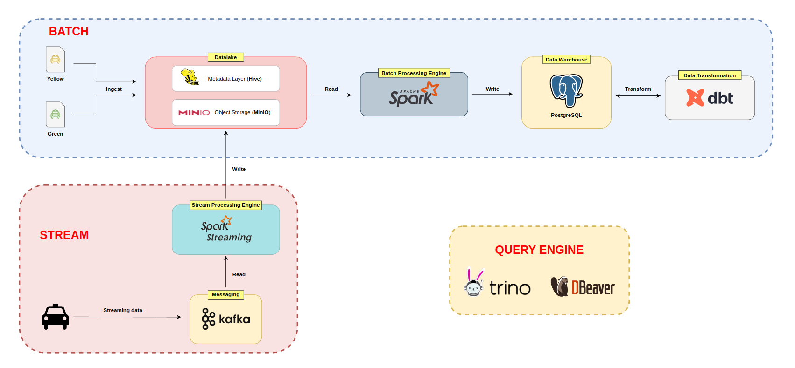

# Big Data Project

In today's data-driven landscape, analyzing extensive datasets is essential for deriving business insights. Our Taxi Data Analytics application leverages Spark, Kafka, and DBT to convert raw taxi trip data into actionable intelligence.

## Challenge: Data Integration Issues

At the beginning, our operations encountered considerable difficulties in integrating various data sources. The diversity in systems and formats posed challenges in consolidating and thoroughly analyzing trip data.

This fragmentation led to incomplete insights and impeded our capability to make informed decisions based on data effectively. Hence, we required a robust solution to consolidate our data sources or streamline the analysis process.

## System Architecture

<p align="center">


<p align="center">
    System Architecture
</p>

## Prerequisites

Before running this script, ensure you have the following installed:

- Python 3.9
- Docker
- Apache Spark
- PostgreSQL
- DBT
- Confluent Containers (Zookeeper, Broker, Kafka, Schema Registry, Control Center)
- MinIO, Trino, DBeaver

## Getting Started

1.  **Clone the repository**:

    ```bash
    git clone https://github.com/ # Your github repository
    ```

2.  **Start all infrastructures**

    ```bash
    make run_all
    ```

    This command will download the necessary Docker images, create containers, and start the services in detached mode.

3.  **Setup environment**

    ```bash
    conda create -n bigdata python==3.9
    y
    conda activate bigdata
    pip install -r requirements.txt
    ```

    Activate your conda environment and install required packages

4.  **Access the Services**

    - Postgres is accessible on the default port `5432`.
    - Kafka Control Center is accessible at `http://localhost:9021`.
    - MinIO is accessible at `http://localhost:9001`.

## How-to Guide

### I. Batch Processing

1.  **Push the data (parquet format) from local to Datalake (MinIO)**

    ```bash
    python src/export_data_to_datalake.py
    ```

2.  **Create schema and table in Trino**

    After running the Python file, the result returns the command to create the data schema and create the table in <b>Trino</b>:

    ```bash
    python src/trino_db_scripts_generate.py
    ```

    Execute `trino` container by the following command:

    ```bash
    docker exec -ti datalake-trino bash
    trino
    ```

    After that, run the following command to register a new schema for our data:

    ```sql
    CREATE SCHEMA IF NOT EXISTS ...;

    CREATE TABLE IF NOT EXISTS ...;
    ```

3.  **Query data in MinIO with DBeaver**

    Install `DBeaver` as in the following [guide](https://dbeaver.io/download/)

    Connect to our database (type `trino`) using the following information (empty `password`):
    

4.  **Create schema `staging`, `dw` and table `staging.nyc_taxi` in PostgreSQL**

    ```bash
    python utils/create_schema.py
    python utils/create_table.py
    ```

5.  **Execute Spark to read, process the data from Datalake and save to Staging Area**

    ```bash
    python batch_processing/datalake_to_dw.py
    ```

    This command may take a little time to process.

6.  **Use DBT to transform the data to create the dimension the fact tables**

    ```bash
    cd dbt_nyc
    dbt run
    ```

7.  **(Optional) Check the data in the Data Warehouse**

### II. Stream Processing

1. **Create a data stream that is continuously sent to the Kafka Topic `nyc_taxi_device`**

   ```bash
   python src/streaming_data.py
   ```

   Access `localhost:9021` to check the data stream in the `nyc_taxi_device` Topic.

2. **Execute Spark Streaming to process the streaming data and save to Datalake (MinIO)**

   ```bash
   python stream_processing/streaming_to_datalake.py
   ```

3. **(Optional) Read the streaming data (parquet format) after storage**

   Access `localhost:9001`, bucket `datalake`, and copy any parquet file name into Python script `stream_processing/read_parquet_streaming.py`

   ```bash
   python stream_processing/read_parquet_streaming.py
   ```

---

### Reference:

[1] [NYC Taxi Trip Dataset](https://www.nyc.gov/site/tlc/about/tlc-trip-record-data.page)

docker compose -f airflow-docker-compose.yaml up -d --build
