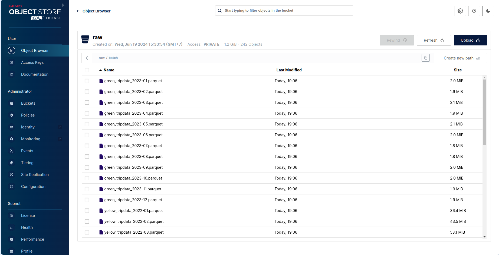
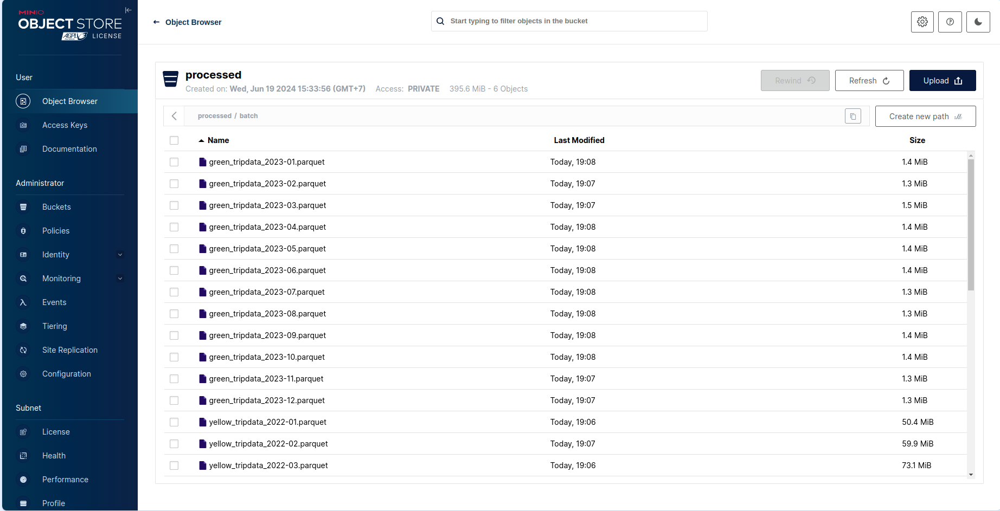
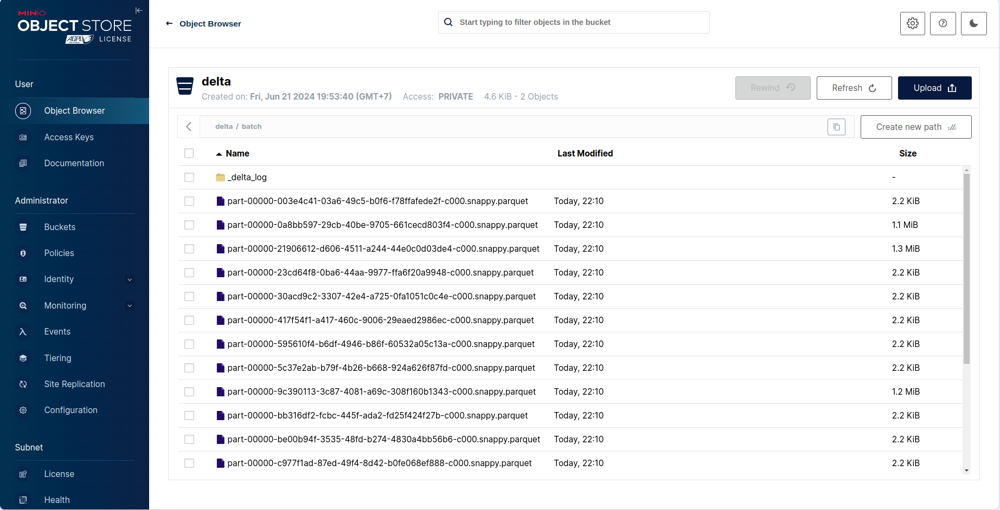
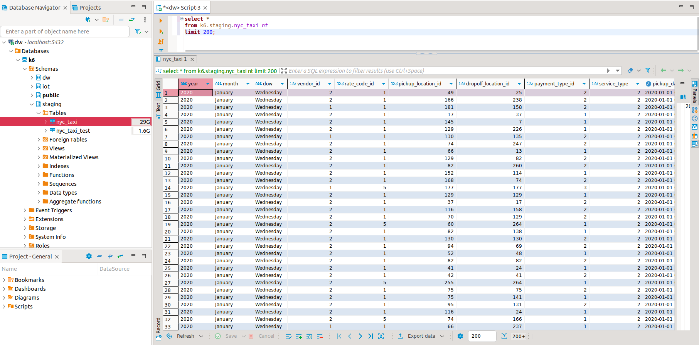
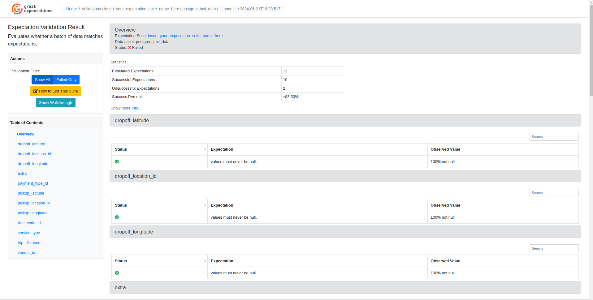
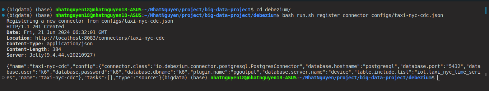
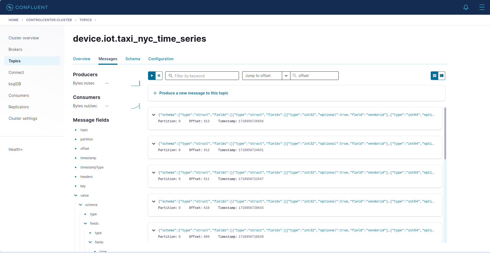
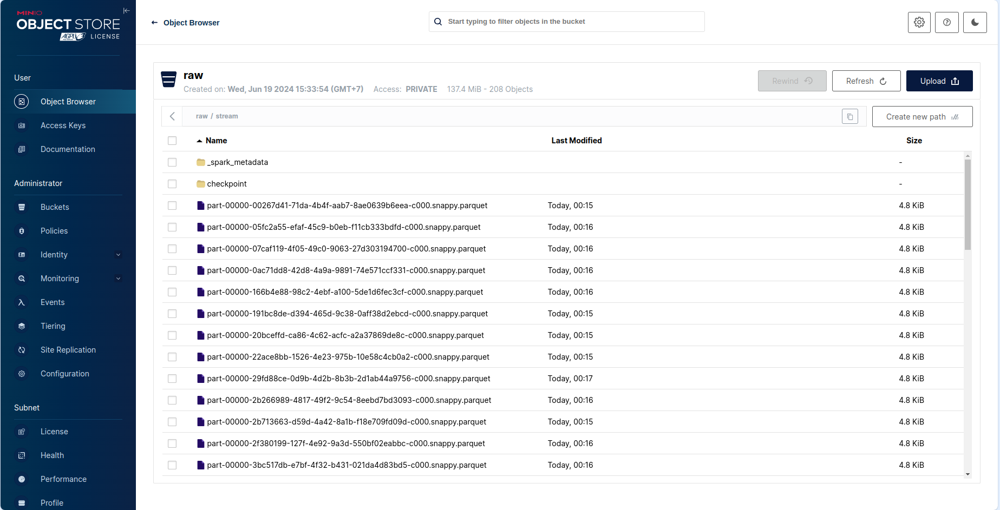

# NYC_TAXI Data Engineer Project - MLE2 - Module 2

In today's data-driven landscape, analyzing extensive datasets is essential for deriving business insights. Our Taxi Data Analytics application leverages Airflow, Spark, Delta Lake, Debezium, Kafka, DBT, and Great Expectations to convert raw taxi trip data into actionable intelligence.

## Challenge: Data Integration Issues

At the beginning, our operations encountered considerable difficulties in integrating various data sources. The diversity in systems and formats posed challenges in consolidating and thoroughly analyzing trip data.

This fragmentation led to incomplete insights and impeded our capability to make informed decisions based on data effectively. Hence, we required a robust solution to consolidate our data sources or streamline the analysis process.

## System Architecture

<p align="center">


<p align="center">
    System Architecture
</p>

## Repository structure:

```shell
.
    ├── airflow/                                     /* airflow folder including dags,.. /*
    │   ├── config/                                     /* contain config files for airflow /*
    │   ├── dags/                                       /* contain all dags in pipeline /*
    │       ├── elt_pipeline_dag.py                         /* dag: extract - load - process (ELT pipeline) and convert to delta lake format /*
    │       └── delta_dag.py                                /* dag: convert parquet to delta lake format /*
    │   ├── ...
    │   ├── Dockerfile                                  /* build image to run airflow container /*
    │   └── requirements.txt                            /* dependencies for airflow /*
    ├── batch_processing/
    │   ├── datalake_to_dw.py                           /* ETL data from datalake to staging area /*
    │   ├── helpers.py
    │   └── minio_utils.py                              /* functions: list_parquet_files in bucket (MinIO) /*
    ├── configs/                                    /* contain config files /*
    │   ├── datalake_airflow.yaml
    │   └── datalake.yaml
    ├── data/                                       /* contain dataset /*
    │   ├── 2020/
    │   ├── 2021/
    │   ├── 2022/
    │       ├── green_tripdata_2022-01.parquet
    │       ├── green_tripdata_2022-02.parquet
    │       ├── green_tripdata_2022-03.parquet
    │       ├── ...
    │       ├── yellow_tripdata_2022-01.parquet
    │       ├── yellow_tripdata_2022-02.parquet
    │       ├── yellow_tripdata_2022-03.parquet
    │       └── ...
    │   ├── 2023/
    │   └── 2024/
    ├── data_validation/                            /* validate data before loading data warehouse /*
    │   ├── gx/
    │       ├── checkpoints/
    │       ├── expectations/
    │       ├── ...
    │       └── great_expections.yml
    │   ├── full_flow.ipynb
    │   └── reload_and_validate.ipynb
    ├── dbt_nyc/                                    /* data transformation folder /*
    ├── debezium/                                   /* CDC folder /*
    │    ├── configs/
    │       └──  taxi-nyc-cdc-json                           /* file config to connect between database and kafka through debezium  /*
    │    └── run.sh                                     /* run create connector */
    ├── imgs/
    ├── jars/                                       /* JAR files for Spark version 3.5.1 */
    ├── src/
    │   ├── data/
    │       └── taxi_lookup.csv                             /* CSV file to look up latitude and longitude */
    │   ├── export_data_to_datalake.py                  /* upload data from local to 'raw' bucket (MinIO) */
    │   ├── helpers.py
    │   ├── preprocessing.py                            /* pre-process dataset in local */
    │   ├── streaming_data_json.py                      /* stream data json format into kafka */
    │   └── trino_db_scripts_generate.py
    ├── src_airflow/
    │   ├── data/
    │       └── taxi_lookup.csv
    │   ├── convert_to_delta.py
    │   ├── elt_pipeline.py                             /* ELT pipeline: extract - load - process */
    │   └── helpers.py
    ├── streaming_processing/
    │    ├── read_parquet_streaming.py
    │    └──  streaming_to_datalake.py              /* read data stream in kafka topic and write to 'raw' bucket (Minio) */
    ├── trino/
    │    ├── catalog/
    │       └──  datalake.properties
    │    ├── etc/
    │       ├── config.properties
    │       ├── jvm.config
    │       └── node.properties
    ├── utils/                                     /* functions /*
    │    ├── create_schema.py
    │    ├── create_table.py
    │    ├── postgresql_client.py
    │    └──  streaming_data.db.py
    ├── .env
    ├── .gitignore
    ├── airflow-docker-compose.yaml
    ├── docker-compose.yaml
    ├── Makefile
    ├── README.md
    ├── requirements.txt
    └── stream-docker-compose.yaml
```

## Getting Started

1.  **Clone the repository**:

    ```bash
    git clone https://github.com/trannhatnguyen2/data-engineer-mle2 # Your github repository
    ```

2.  **Start all infrastructures**:

    ```bash
    make run_all
    ```

    This command will download the necessary Docker images, create containers, and start the services in detached mode.

3.  **Setup environment**:

    ```bash
    conda create -n bigdata python==3.9
    y
    conda activate bigdata
    pip install -r requirements.txt
    ```

    Activate your conda environment and install required packages

4.  **Access the Services**:

    - Postgres is accessible on the default port `5432`.
    - Kafka Control Center is accessible at `http://localhost:9021`.
    - Debezium is accessible at `http://localhost:8085`.
    - MinIO is accessible at `http://localhost:9001`.
    - Airflow is accessible at `http://localhost:8080`.

5.  **Download Dataset**:
    You can download and use this dataset in here: https://www.nyc.gov/site/tlc/about/tlc-trip-record-data.page

6.  **Download JAR files for Spark**:

    ```bash
    mkdir jars
    cd jars
    curl -O https://repo1.maven.org/maven2/com/amazonaws/aws-java-sdk-bundle/1.12.262/aws-java-sdk-bundle-1.12.262.jar
    curl -O https://repo1.maven.org/maven2/org/apache/hadoop/hadoop-aws/3.3.4/hadoop-aws-3.3.4.jar
    curl -O https://repo1.maven.org/maven2/org/postgresql/postgresql/42.4.3/postgresql-42.4.3.jar
    curl -O https://repo1.maven.org/maven2/org/apache/spark/spark-sql-kafka-0-10_2.12/3.2.1/spark-sql-kafka-0-10_2.12-3.2.1.jar
    ```

## How-to Guide

### I. Batch Processing

1.  **Push the data (parquet format) from local to `raw` bucket - Datalake (MinIO)**:

```bash
    python src/local_to_raw.py
```

<p align="center">


<p align="center">
    Pushed the data to MinIO successfully
</p>

2. **Process the data from `raw` to `processed` bucket (MinIO)**:

```bash
    python src/raw_to_processed.py
```

<p align="center">


<p align="center">
    Processed the data successfully
</p>

3. **Convert the data into Delta Lake format**:

```bash
    python src/processed_to_delta.py
```

<p align="center">


<p align="center">
    Converted the data successfully
</p>

4. **Create schema `staging`, `dw` and table `staging.nyc_taxi` in PostgreSQL**

```bash
   python utils/create_schema.py
   python utils/create_table.py
```

5. **Execute Spark to read, process the data from Datalake (MinIO) and write to Staging Area**

```bash
   python batch_processing/datalake_to_dw.py
```

This command may take a little time to process.

<p align="center">


<p align="center">
    Queried the data after executing Spark
</p>

6. **Validate data in Staging Area**

```bash
   cd data_validation
   great_expectations init
   Y
```

Then, run the file `full_flow.ipynb`

<p align="center">


<p align="center">
    Validated the data using Great Expectations
</p>

7. **Use DBT to transform the data to create the dimension the fact tables**

```bash
   cd dbt_nyc
```

Read `README.md` for the next steps

8. **(Optional) Check the data in the Data Warehouse**

<p align="center">


### II. Stream Processing

1. **Create Connector Postgres to Debezium**:

```bash
   cd debezium/
   bash run.sh register_connector configs/taxi-nyc-cdc.json
```

<p align="center">


<p align="center">
    Created Debezium Connector successfully
</p>

2. **Create an empty table in PostgreSQL and insert new record to the table**:

```bash
   cd ..
   python utils/create_schema.py
   python utils/create_table.py
   python utils/streaming_data_db.py
```

Access `localhost:9021` to check the data stream in the `device.iot.taxi_nyc_time_series` Topic.

<p align="center">


<p align="center">
    Data stream in `device.iot.taxi_nyc_time_series` Kafka Topic
</p>

3. **Read and write data stream to 'raw' bucket in MinIO**

```bash
   python stream_processing/streaming_to_datalake.py
```

<p align="center">


<p align="center">
    Data Stream stored into 'raw' bucket in MinIO
</p>

4. **(Optional) Read data streaming in MinIO**

After putting your files to ` MinIO`, please execute `trino` container by the following command:

```bash
docker exec -ti datalake-trino bash
trino
```

After that, run the following command to register a new schema for our data:

```sql

    CREATE SCHEMA IF NOT EXISTS datalake.stream
    WITH (location = 's3://raw/');

    CREATE TABLE IF NOT EXISTS datalake.stream.nyc_taxi(
        VendorID                INT,
        tpep_pickup_datetime    TIMESTAMP,
        tpep_dropoff_datetime   TIMESTAMP,
        passenger_count         DOUBLE,
        trip_distance           DOUBLE,
        RatecodeID              DOUBLE,
        store_and_fwd_flag      VARCHAR,
        PULocationID            INT,
        DOLocationID            INT,
        payment_type            INT,
        fare_amount             DOUBLE,
        extra                   DOUBLE,
        mta_tax                 DOUBLE,
        tip_amount              DOUBLE,
        tolls_amount            DOUBLE,
        improvement_surcharge   DOUBLE,
        total_amount            DOUBLE,
        congestion_surcharge    DOUBLE,
        airport_fee             DOUBLE
    ) WITH (
        external_location = 's3://raw/stream',
        format = 'PARQUET'
    );

```

### III. Airflow - Data Orchestration

```bash
   cd airflow/
```

Read `README.md` for the next steps

### Reference:

[1] [NYC Taxi Trip Dataset](https://www.nyc.gov/site/tlc/about/tlc-trip-record-data.page)
