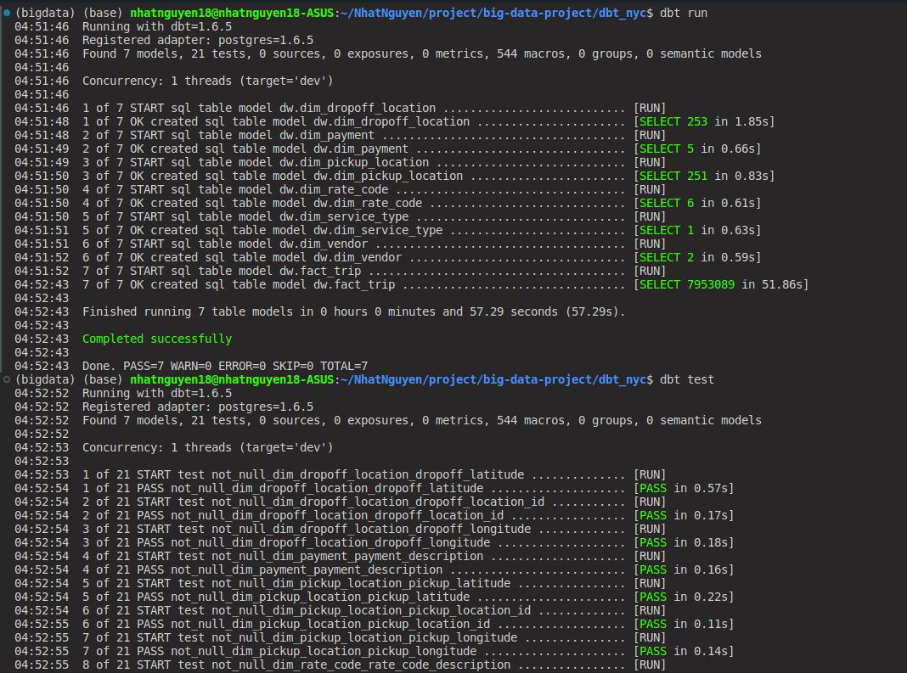

Welcome to your new dbt project!

# Data Transformation DBT

## Getting Started

1.  **Create dbt project**:

    ```bash
    dbt init
    ```

    Run this command and enter a name of your project `dbt_nyc`, after that you can the folder `dbt_nyc` with the following structure:

```txt
.
├── dbt_nyc/
    ├── analyses/
    ├── dbt_packages/                                   /* you can see after running dbt deps /*
    │   └── dbt_utils/
    ├── logs/
    │   └── dbt.log
    ├── macros/                                         /* contain functions to use in models /*
    │   ├── generate_schema_name.sql
    │   ├── get_payment_description.sql
    │   ├── get_rate_code_description.sql
    │   ├── get_service_name.sql
    │   └── get_vendor_description.sql
    ├── models/
    │   └── dw/
    │       ├── dim_dropoff_location.sql
    │       ├── dim_payment.sql
    │       ├── dim_pickup_location.sql
    │       ├── dim_rate_code.sql
    │       ├── dim_service_type.sql
    │       ├── dim_vendor.sql
    │       ├── fact_trip.sql
    │       └── schema.yml
    ├── seeds/                                          /* contain data file for ingesting into the data warehouse /*
    ├── snapshots/                                      /* snapshots to record changes to mutable table over time (SCD Type 2) /*
    ├── target/
    ├── test/
    ├── .gitignore
    ├── .uer.yml
    ├── dbt_project.yml
    ├── packages.yml                                    /* create to install deps /*
    ├── profiles.yml
    └──  README.md                                      /* guide /*
```

2. **Manage dependencies**:

   Create `packages.yml` into `dbt_nyc` folder:

   ```txt
        packages:
        - package: dbt-labs/dbt_utils
            version: 0.8.0
   ```

   Then run this `dbt deps` to install the packages - by default this directory is ignored by git, to avoid duplicating the source code for the package.

   ```bash
   dbt deps
   ```

3. **Running dbt project**:

   Try running the following commands:

   ```bash
   dbt run
   dbt test
   ```

## Result:



## Resources:

- Learn more about dbt [in the docs](https://docs.getdbt.com/docs/introduction)
- Check out [Discourse](https://discourse.getdbt.com/) for commonly asked questions and answers
- Join the [chat](https://community.getdbt.com/) on Slack for live discussions and support
- Find [dbt events](https://events.getdbt.com) near you
- Check out [the blog](https://blog.getdbt.com/) for the latest news on dbt's development and best practices
